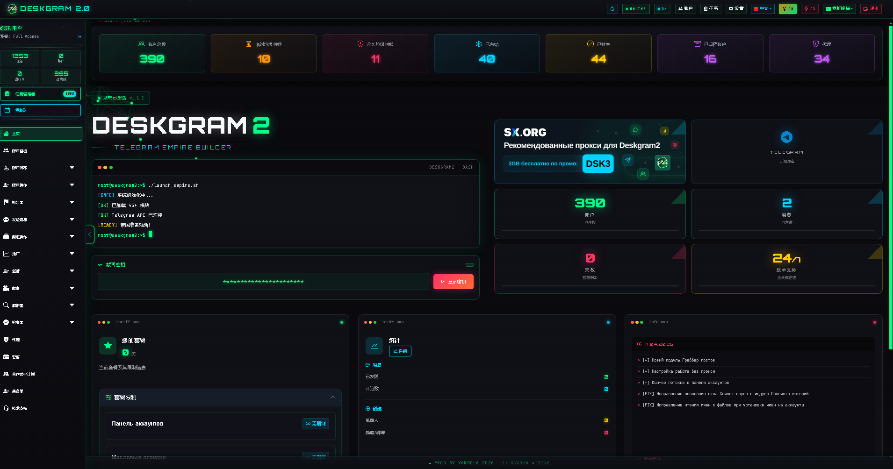
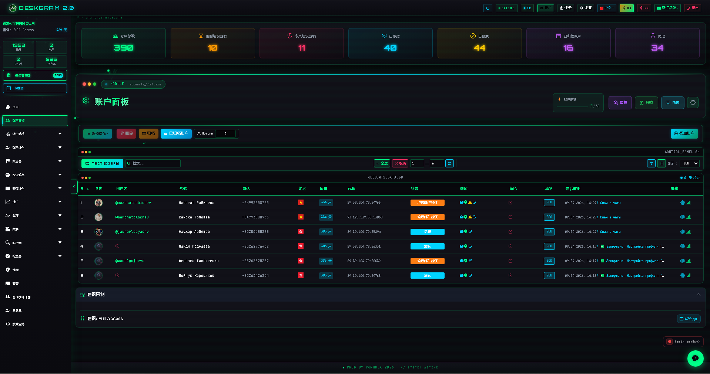
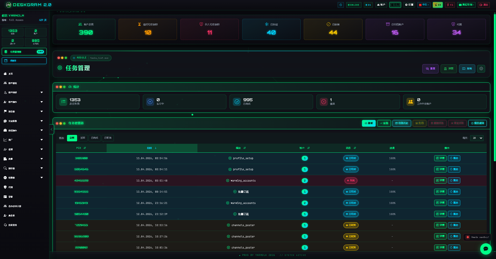
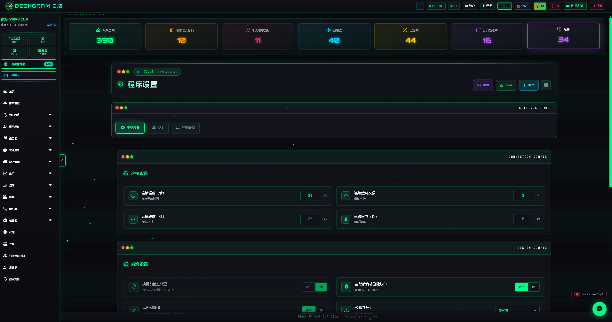

# Deskgram 2 Telegram 自动化平台

Deskgram 2 是一个围绕 Telegram 自动化工作流构建的平台，包含账号管理、私信群发、AI 模块、受众收集、批量订阅、代理基础设施和任务控制面板。

[官网](https://deskgram2.com/) | [Telegram Bot](https://t.me/DG2welcomebot) | [Web Preview](https://deskgram2.com/web-preview) | [优势说明](https://deskgram2.com/advantages)

## 平台概览

| 模块 | 用途 |
|---|---|
| 账号面板 | 管理 Telegram 账号、分组、筛选和基础工作区 |
| 任务面板 | 监控运行中的流程、状态和执行结果 |
| 设置 | 配置系统参数、API Key、AI 提供商和通知 |
| 私信群发 | 对准备好的受众执行私信触达流程 |
| 神经评论 | 对 Telegram 新帖子执行 AI 评论和跟进 |
| 受众收集 | 从群组、聊天或其他来源整理用户基础 |
| 批量订阅 | 批量加入频道、群组和文件夹 |

## Deskgram 2 适合做什么

- 构建 Telegram 自动化工作流；
- 管理多账号和代理基础设施；
- 为私信、邀请、收集和 AI 场景提供统一界面；
- 在一个工作区里集中处理任务、日志和状态。

## 快速开始

1. 先完成设置、账号和代理的基础准备。
2. 根据目标选择受众收集、私信群发、神经评论或批量订阅模块。
3. 在任务面板中跟踪执行状态和结果。
4. 通过相关模块之间的链接继续扩展工作流。

## 界面预览

### 平台总览

### 账号面板

### 任务面板

### 设置

## 推荐阅读路径

| 目标 | 先看什么 |
|---|---|
| 做 Telegram 私信触达 | 受众收集 -> 私信群发 |
| 做帖子互动和 AI 评论 | 神经评论 |
| 批量加入频道或群组 | 批量订阅 |
| 搭建稳定基础设施 | 账号面板 -> 设置 |

## 执行型仓库

- [神经评论](https://github.com/Deskgram-2/telegram-neuro-commenting-deskgram-zh)
- [私信群发](https://github.com/Deskgram-2/telegram-direct-messaging-deskgram-zh)
- [受众收集](https://github.com/Deskgram-2/telegram-audience-parser-deskgram-zh)
- [批量订阅](https://github.com/Deskgram-2/telegram-join-groups-deskgram-zh)

## 基础设施与控制仓库

- [邀请模块](https://github.com/Deskgram-2/telegram-invite-tool-deskgram-zh)
- [代理管理](https://github.com/Deskgram-2/telegram-proxy-manager-deskgram-zh)
- [账号面板](https://github.com/Deskgram-2/telegram-account-manager-deskgram-zh)
- [任务管理器](https://github.com/Deskgram-2/telegram-task-manager-deskgram-zh)
- [设置](https://github.com/Deskgram-2/telegram-automation-settings-deskgram-zh)

## 已发布中文仓库之间怎么衔接

- [账号面板](https://github.com/Deskgram-2/telegram-account-manager-deskgram-zh) -> [代理管理](https://github.com/Deskgram-2/telegram-proxy-manager-deskgram-zh) -> [设置](https://github.com/Deskgram-2/telegram-automation-settings-deskgram-zh) 构成基础设施层。
- [受众收集](https://github.com/Deskgram-2/telegram-audience-parser-deskgram-zh) -> [私信群发](https://github.com/Deskgram-2/telegram-direct-messaging-deskgram-zh) 是当前中文波次里最直接的触达链路。
- [批量订阅](https://github.com/Deskgram-2/telegram-join-groups-deskgram-zh) -> [邀请模块](https://github.com/Deskgram-2/telegram-invite-tool-deskgram-zh) 适合增长和环境准备。
- [设置](https://github.com/Deskgram-2/telegram-automation-settings-deskgram-zh) -> [神经评论](https://github.com/Deskgram-2/telegram-neuro-commenting-deskgram-zh) -> [任务管理器](https://github.com/Deskgram-2/telegram-task-manager-deskgram-zh) 是当前中文 AI/执行/控制链。

## 推荐工作流链路

- [账号面板](https://github.com/Deskgram-2/telegram-account-manager-deskgram-zh) -> [代理管理](https://github.com/Deskgram-2/telegram-proxy-manager-deskgram-zh) -> [设置](https://github.com/Deskgram-2/telegram-automation-settings-deskgram-zh) -> [受众收集](https://github.com/Deskgram-2/telegram-audience-parser-deskgram-zh) -> [私信群发](https://github.com/Deskgram-2/telegram-direct-messaging-deskgram-zh)
- [账号面板](https://github.com/Deskgram-2/telegram-account-manager-deskgram-zh) -> [批量订阅](https://github.com/Deskgram-2/telegram-join-groups-deskgram-zh) -> [邀请模块](https://github.com/Deskgram-2/telegram-invite-tool-deskgram-zh)
- [设置](https://github.com/Deskgram-2/telegram-automation-settings-deskgram-zh) -> [神经评论](https://github.com/Deskgram-2/telegram-neuro-commenting-deskgram-zh) -> [任务管理器](https://github.com/Deskgram-2/telegram-task-manager-deskgram-zh)
- [受众收集](https://github.com/Deskgram-2/telegram-audience-parser-deskgram-zh) -> [邀请模块](https://github.com/Deskgram-2/telegram-invite-tool-deskgram-zh) -> [任务管理器](https://github.com/Deskgram-2/telegram-task-manager-deskgram-zh)
- [账号面板](https://github.com/Deskgram-2/telegram-account-manager-deskgram-zh) -> [批量订阅](https://github.com/Deskgram-2/telegram-join-groups-deskgram-zh) -> [受众收集](https://github.com/Deskgram-2/telegram-audience-parser-deskgram-zh) -> [私信群发](https://github.com/Deskgram-2/telegram-direct-messaging-deskgram-zh)

## 相关仓库

- [神经评论](https://github.com/Deskgram-2/telegram-neuro-commenting-deskgram-zh)
- [私信群发](https://github.com/Deskgram-2/telegram-direct-messaging-deskgram-zh)
- [受众收集](https://github.com/Deskgram-2/telegram-audience-parser-deskgram-zh)
- [批量订阅](https://github.com/Deskgram-2/telegram-join-groups-deskgram-zh)

## FAQ

### Deskgram 2 更像单个工具还是完整平台？

更接近完整平台，因为它把账号、基础设施、执行模块和任务控制放在同一个工作区里。

### 从哪个模块开始最合适？

通常先准备设置、账号和代理，然后再进入受众收集、私信群发或 AI 模块。
